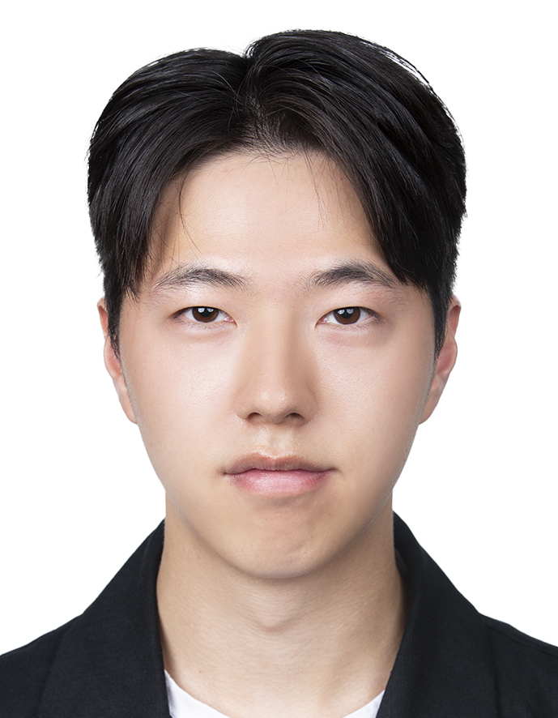
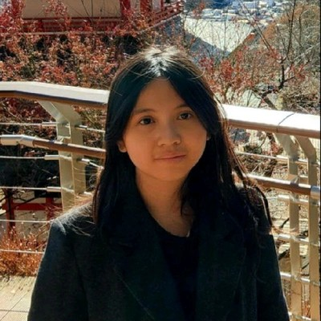
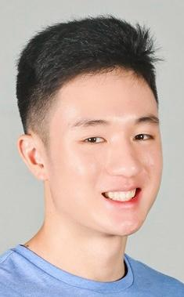

We are a team based in the [School of Computing, National University of Singapore](https://www.comp.nus.edu.sg).

You can reach us at the email `seer[at]comp.nus.edu.sg`

## Project team

### Henry Tse

[[homepage](http://iota113.github.io)]
[[github](https://github.com/iota113)]
[[portfolio](http://iota113.github.io)]

* Role: Deliverables and deadlines, Scheduling and tracking
* Responsibilities: Model, Logic

### Kim Yungju

[[github](https://github.com/kimyungju)]
[[portfolio](https://www.linkedin.com/in/yungju)]

* Role: Developer
* Responsibilities: UI

### Shana Nadia Sjariffudin

[[github](http://github.com/shana-nadia)]
[[portfolio](https://www.linkedin.com/in/shana-sjariffudin-3a52453a9/)]

* Role: Team Member
* Responsibilities: Storage

### Sean Sukamto

[[github](http://github.com/seansukamto)]
[[portfolio](https://www.linkedin.com/in/sean-sukamto-a866682a2/)]

* Role: Developer
* Responsibilities: UI

### Elliot Yong

[[github](https://github.com/yytelliot)]
[[portfolio](https://www.linkedin.com/in/elliot-yong-b69526348)]

* Role: Code quality, git expert
* Responsibilities: Model
